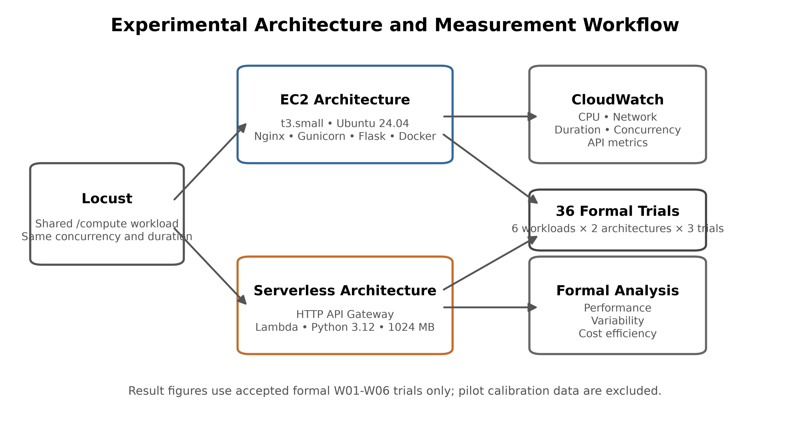
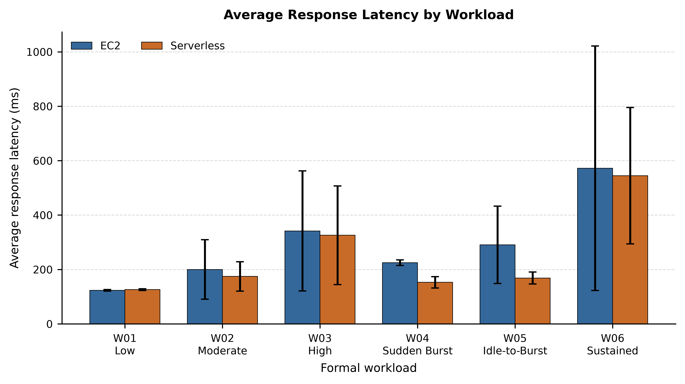
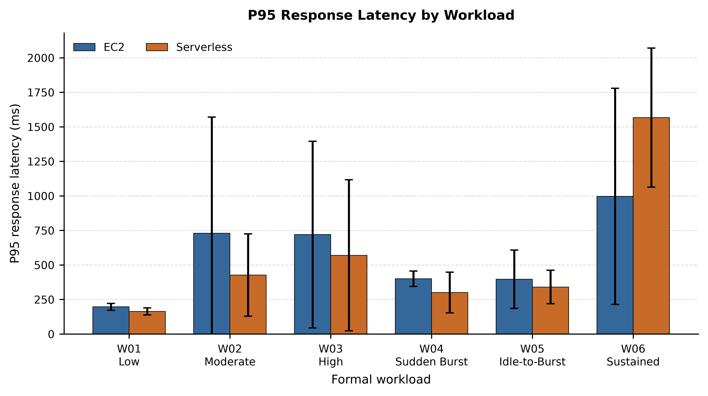
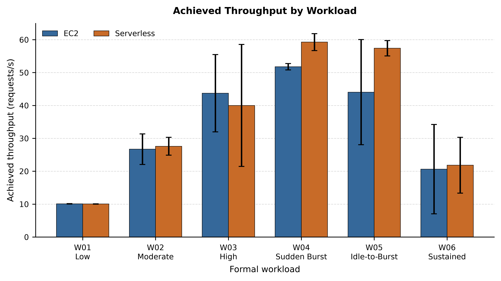
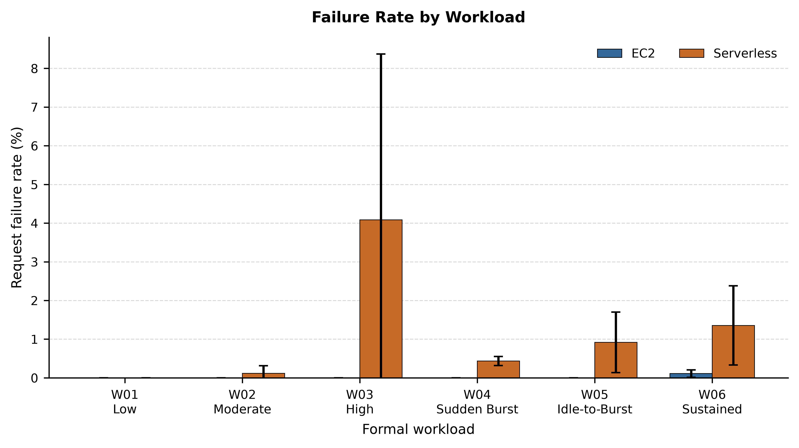
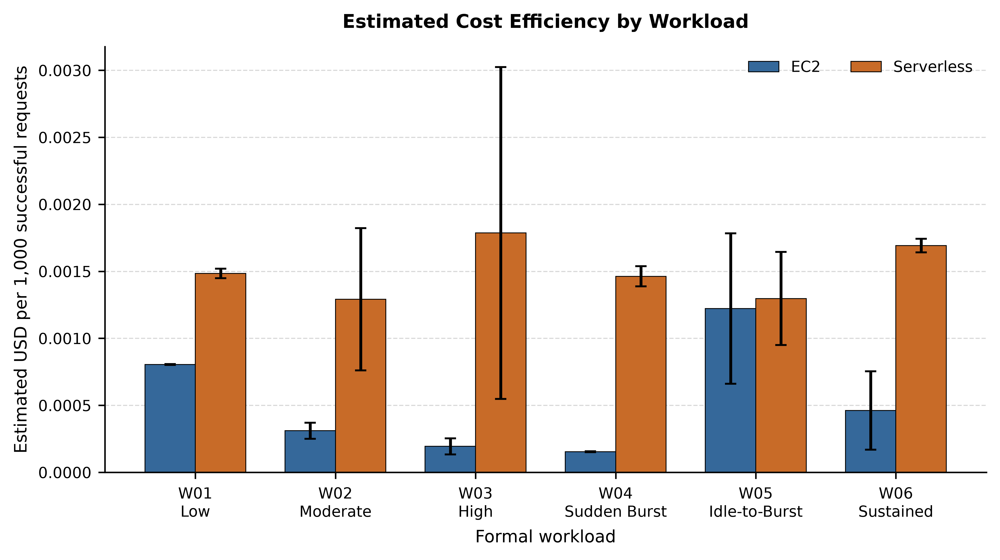
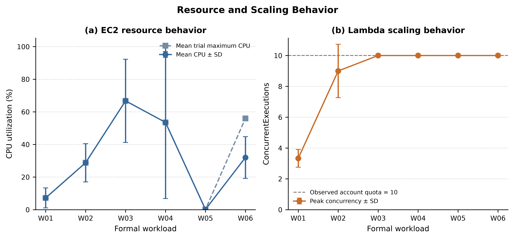

# Experimental Evaluation of EC2-Based and Serverless Architectures for Bursty Web Application Workloads on AWS: Performance, Scalability, and Cost Trade-offs

**Shaheen Sardar**  
Independent Researcher, Pakistan

**Preprint**

## Abstract

Cloud applications can be deployed on continuously provisioned virtual machines or on serverless platforms that allocate compute on demand. The practical choice between these models is workload-dependent because latency, tail behavior, throughput, reliability, scaling constraints, and cost can move in different directions. This study presents a controlled experimental comparison of an Amazon EC2 architecture and an AWS serverless architecture for a deterministic CPU-bound web workload. The EC2 system used a `t3.small` instance running Ubuntu 24.04, Flask, Gunicorn, and Nginx. The serverless system used Amazon API Gateway HTTP API and an AWS Lambda function configured with Python 3.12, x86_64, and 1024 MB of memory. Both systems executed the same `/compute` logic consisting of 25,000 chained SHA-256 operations. Six frozen workload profiles—low, moderate, high, sudden burst, idle-to-burst, and sustained—were evaluated using the same Locust client behavior, with three accepted repetitions per architecture and workload, yielding 36 formal trials. Descriptive statistics were used because each condition had only three repetitions.

The results show a workload-dependent trade-off rather than a universal winner. Under the sudden-burst workload, Serverless reduced average latency by 32.1% and increased achieved throughput by 14.5%, but its mean failure rate was 0.434% versus 0.000% for EC2 and its normalized cost per 1,000 successful requests was 9.50× the EC2 value. In the idle-to-burst workload, Serverless reduced average latency by 41.9% and increased achieved throughput by 30.3%, while its cost per 1,000 successful requests moved much closer to EC2 at 1.06×. Sustained-load results were more mixed: Serverless achieved +5.8% relative throughput difference, but its P95 latency differed by +57.2% and reliability remained lower. Across the formal experiment, EC2 generally provided lower normalized request cost and stronger reliability, whereas Serverless often provided favorable responsiveness under burstier workloads. The study also separates AWS Lambda service behavior from an account-specific concurrency quota of 10 that constrained the experimental account; this quota is not treated as a general Lambda scalability limit.

**Keywords—** cloud computing, serverless computing, AWS Lambda, Amazon EC2, Function-as-a-Service, burst workloads, tail latency, scalability, cloud cost, performance evaluation

---

# 1. Introduction

## 1.1 Background

Cloud platforms expose multiple execution models for web applications. A virtual-machine model gives the operator direct control over provisioned compute capacity and the software stack, whereas Function-as-a-Service (FaaS) shifts much of provisioning, scaling, and runtime lifecycle management to the provider. Serverless computing is commonly presented as an elasticity- and operations-oriented model, but prior work has shown that the apparent simplicity of the programming interface hides nontrivial resource-management, isolation, startup, and performance behavior [1], [2]. Production FaaS traces also show highly variable invocation frequencies, motivating resource management that can handle intermittent and bursty demand [3].

AWS Lambda is one prominent FaaS platform. Its default compute model uses isolated execution environments, and AWS has described Firecracker microVMs as part of the isolation foundation used by Lambda [4]. By contrast, Amazon EC2 provides explicitly provisioned virtual machines whose lifecycle is controlled by the user. These architectural differences imply different performance and cost behavior: EC2 capacity is paid for while provisioned, whereas Lambda Functions are priced primarily by requests and execution duration [12], [13].

## 1.2 Problem

A simple statement such as “serverless scales better” or “virtual machines are cheaper” is insufficient for architecture selection. Low demand, gradual load, sudden bursts, idle periods followed by bursts, and sustained load exercise the two deployment models differently. Average latency alone can also conceal tail behavior, while throughput can improve at the same time that reliability or cost deteriorates. Tail latency is particularly important in distributed and online services because high-percentile delays can dominate user-perceived behavior even when average latency appears acceptable [9].

## 1.3 Research Gap

Existing research has characterized commercial serverless platforms [2], production FaaS workloads [3], cold-start and launch overheads [5], [6], alternative serverless runtimes [7], and formal performance/cost models for FaaS applications [8]. These studies establish that serverless behavior depends on resource management, workload shape, isolation mechanisms, and billing semantics. The present study does not claim that EC2-versus-serverless comparison is itself novel. Instead, it contributes a reproducible, controlled comparison in which the application-level computation, request endpoint, client behavior, AWS Region, workload definitions, trial count, metric-extraction pipeline, and normalized cost methodology are frozen before formal analysis. The aim is to produce a transparent case study of workload-dependent trade-offs rather than a universal platform ranking.

## 1.4 Research Questions

This study addresses four research questions:

**RQ1.** How do EC2 and serverless architectures differ in average latency, P95/P99 tail latency, and achieved throughput across low, moderate, high, burst, idle-to-burst, and sustained workloads?

**RQ2.** How do reliability and observed scaling behavior change as concurrency and burstiness increase?

**RQ3.** How does estimated cost per 1,000 successful requests differ between continuously provisioned EC2 capacity and request/duration-based serverless execution?

**RQ4.** How should resource behavior and an account-specific Lambda concurrency quota be interpreted without generalizing an experimental account constraint to AWS Lambda as a service?

## 1.5 Contributions

The main contributions are:

1. A controlled EC2-versus-serverless experiment using identical deterministic application-level computation.
2. Six frozen workload profiles that distinguish low, moderate, high, sudden-burst, idle-to-burst, and sustained behavior.
3. Thirty-six accepted formal trials, with three repetitions for each workload/architecture condition and descriptive variability reporting.
4. Joint analysis of average latency, median latency, P95/P99 latency, achieved throughput, request failures, CloudWatch resource metrics, and normalized list-price cost.
5. Explicit separation of formal results from pilot calibration data and explicit separation of Lambda platform behavior from the experimental account's concurrency quota.
6. A reproducibility package containing processed data, non-sensitive methodology artifacts, analysis scripts, tables, and figures.

---

# 2. Related Work

Hellerstein et al. framed serverless computing as an important cloud-computing direction while emphasizing that provider-managed execution introduces both opportunities and architectural constraints [1]. Wang et al. conducted a large measurement study of AWS Lambda, Azure Functions, and Google Cloud Functions, characterizing scalability, cold-start latency, isolation, and resource efficiency from a customer perspective [2]. Their work is particularly relevant to the present study because it demonstrates that commercial serverless platforms should be evaluated empirically rather than treated as homogeneous abstractions.

Shahrad et al. analyzed a large production FaaS workload and showed extreme variation in invocation frequency, reinforcing the importance of irregular and bursty workload behavior in serverless resource management [3]. Startup behavior is also a recurring concern. Boucher et al. showed that conventional FaaS launch paths can impose substantial cold-launch latency [6], while Akkus et al. designed SAND to reduce startup delays and improve elasticity/resource efficiency [5]. AWS itself distinguishes cold initialization from reuse of retained execution environments; therefore, an idle interval alone does not prove that a later invocation is a cold start [11]. This distinction is important for the present W05 idle-to-burst experiment.

The isolation and runtime substrate of serverless platforms also affects performance. Agache et al. described Firecracker, a microVM monitor designed for serverless workloads and deployed in AWS Lambda and Fargate [4]. Shillaker and Pietzuch demonstrated that alternative isolation approaches can materially affect throughput and tail latency [7]. These systems results motivate measuring both central tendency and high-percentile latency rather than relying on average response time alone.

Economic trade-offs are similarly workload-dependent. Lin et al. developed fine-grained performance and cost models for FaaS applications and emphasized that performance/cost optimization is difficult because of infrastructure opacity and configuration choices [8]. In practical AWS deployments, the billing bases themselves differ: EC2 On-Demand Instances charge for running provisioned capacity with a minimum billing duration [13], while Lambda Functions charge for requests and GB-second execution duration [12]. API Gateway adds a separate request-priced component for the serverless HTTP path [15]. The present study therefore reports normalized cost per 1,000 successful requests in addition to raw per-trial estimated cost.

Finally, Dean and Barroso's analysis of “tail at scale” establishes why the high-percentile latency distribution matters for interactive systems [9]. Although the present experiment is much smaller than warehouse-scale services, the methodological principle remains relevant: P95 and P99 can reveal behavior hidden by averages. Accordingly, this study treats average latency, tail latency, throughput, reliability, and cost as separate outcome dimensions.

---

# 3. Experimental Methodology

## 3.1 Research Design

The experiment used a controlled repeated-measures design at the configuration level. The primary independent variables were **architecture** (EC2 or Serverless) and **workload profile** (W01–W06). Dependent variables included response latency, tail latency, achieved requests per second, failures, EC2 utilization metrics, Lambda/API Gateway metrics, and estimated cost. Controlled variables included the AWS Region (`ap-south-1`), application-level computation, `/compute` endpoint behavior, Locust client logic, workload definitions, trial duration, measurement pipeline, and analysis procedure.

The formal dataset contains 36 accepted trials: six workloads × two architectures × three repetitions. Because each condition contains only three repetitions, the analysis emphasizes descriptive means, sample standard deviations, ranges, architecture ratios, and relative differences. No p-value or statistical-significance claim is made from these n=3 groups.

## 3.2 EC2 Architecture

The EC2 architecture used a Linux `t3.small` instance in `ap-south-1`, provisioned with Terraform. The application ran in a Python virtual environment, with Gunicorn managed by systemd and Nginx acting as the reverse proxy for the same Flask `/compute` logic. The instance used an 8 GB encrypted gp3 EBS root volume and a public IPv4 endpoint for the client path. Amazon Systems Manager was enabled for management. Detailed EC2 CloudWatch monitoring was used for the formal telemetry pipeline.

The use of `t3.small` is methodologically important. T3 instances are burstable-performance instances governed by CPU credits; AWS documents `t3.small` as a 2-vCPU instance with a 20% baseline per vCPU and T3 instances launch in Unlimited mode by default unless account configuration changes that behavior [14]. Consequently, the measured EC2 results characterize this specific burstable instance configuration rather than “EC2 in general.”

## 3.3 Serverless Architecture

The serverless architecture used Amazon API Gateway HTTP API as the public HTTP entry point and AWS Lambda as the compute layer. The Lambda function used Python 3.12, x86_64 architecture, and 1024 MB of configured memory. Terraform managed the serverless resources. API Gateway and Lambda CloudWatch metrics were collected separately so that front-door latency/error behavior and function execution/scaling behavior could be analyzed without conflating the two services.

AWS documents Lambda concurrency as the number of simultaneous in-flight invocations; when available account concurrency is exhausted, functions can be throttled [10]. The experimental account had an observed regional concurrency quota of 10. This value is treated as an account-specific experimental constraint and is not treated as the normal AWS Lambda service limit.

## 3.4 Identical Computation

Both architectures executed the same deterministic compute routine: 25,000 chained SHA-256 operations (`sha256-v1`). The `/health` endpoint provided a lightweight health check, while `/compute` invoked the controlled CPU-bound routine. Before formal testing, outputs from EC2 and Lambda were verified to produce the same deterministic result. Authentication, databases, sessions, file uploads, and other application features were deliberately excluded to reduce confounding application-level variables.

## 3.5 Workload Model

Locust 2.46.3 generated the formal workload. The same Locust file was used for both architectures; only the destination host changed. Each virtual user repeatedly requested `/compute` with a randomized wait interval of 0.2–0.5 s between completed requests. This is a **closed-loop virtual-user workload**, so requests per second are interpreted as *achieved throughput under the frozen user-concurrency pattern*, not as a separately fixed offered RPS.

**Table 2. Frozen Formal Workload Definitions**

| Workload | Definition | Concurrent users | Spawn rate (users/s) | Load duration (s) | Pre-load idle (s) |
| --- | --- | --- | --- | --- | --- |
| W01 | Low | 5 | 1 | 60 | 0 |
| W02 | Moderate | 15 | 3 | 60 | 0 |
| W03 | High | 30 | 5 | 60 | 0 |
| W04 | Sudden-Burst | 30 | 30 | 60 | 0 |
| W05 | Idle-to-Burst | 30 | 30 | 60 | 300 |
| W06 | Sustained | 20 | 4 | 300 | 0 |

*Note: W05 includes a 300-second idle period before the 60-second burst.*

W01 represents low demand; W02 increases concurrent users gradually; W03 raises concurrency further; W04 creates an abrupt 30-user burst; W05 applies the same burst after a 300-second idle period; and W06 maintains 20 users for five minutes to expose sustained behavior. W05 is intentionally described as *idle-to-burst*, not as a guaranteed cold-start experiment, because AWS may retain a Lambda execution environment across an idle interval [11].

## 3.6 Pilot Calibration

Pilot trials were performed before formal data collection to validate instrumentation and calibrate workload intensity. Pilot data were stored separately and were not used in formal result figures or statistical summaries. The original sudden-burst pilot used 50 users spawned at 50 users/s for 60 s. In the serverless path it produced 405 HTTP 503 failures while the experimental account's Lambda concurrency reached 10; the account quota was also observed as 10. This pilot condition was retained as calibration evidence but excluded from formal analysis. The formal W04 burst was therefore frozen at 30 users with a 30 users/s spawn rate.

The purpose of this calibration was not to hide unfavorable serverless behavior. Instead, it established a repeatable formal workload matrix while preserving the original quota-bound pilot as evidence of an environmental limit. The account quota is discussed explicitly in Section 7.4.

## 3.7 Formal Experiment Design

Each of the six workloads was run three times against EC2 and three times against Serverless, producing 36 accepted formal trials. Experiment identifiers followed the pattern `EC2-Wxx-Tyy` and `SVL-Wxx-Tyy`. The formal runner recorded exact UTC start/end metadata, Locust output, failures, exceptions, and trial configuration. Invalid instrumentation attempts were archived separately rather than silently overwritten. The completed formal audit verified all 36 unique experiment identifiers and preserved a SHA-256 manifest of accepted raw artifacts.

## 3.8 Metrics

Application-level metrics were taken from the `/compute` Locust row: total requests, successful and failed requests, failure percentage, average and median response time, P95/P99 latency, minimum/maximum latency, and requests per second. For each workload/architecture group, the three trial values were summarized using means and sample standard deviations; ranges were also retained.

CloudWatch metrics were extracted from the formal UTC run windows at 60-second granularity. EC2 metrics included `CPUUtilization`, `NetworkIn`, `NetworkOut`, and `StatusCheckFailed`. Lambda metrics included `Invocations`, `Duration`, `Errors`, `Throttles`, and `ConcurrentExecutions`. API Gateway metrics included `Count`, `4XX`, `5XX`, `Latency`, and `IntegrationLatency`. Because CloudWatch rounds and aggregates metric timestamps, these values should be interpreted as one-minute datapoints returned for the requested formal windows rather than millisecond-exact attribution to individual requests.

## 3.9 Cost Methodology

Cost analysis used the current regional AWS list-price snapshot captured during Task 25 rather than the researcher's actual AWS invoice. Free Tier benefits, promotional credits, Savings Plans, Reserved Instance discounts, taxes, and account-specific discounts were excluded so that architecture comparisons would not depend on one account's billing benefits. `actual_cost_usd` was therefore recorded as `NOT_DIRECTLY_ATTRIBUTABLE`, while `estimated_cost_usd` represented the reproducible list-price estimate.

For EC2, the allocation included `t3.small` On-Demand compute, attached gp3 storage, and the in-use public IPv4 address. EC2 allocation time equaled the formal load duration, except W05, where the 300-second idle interval plus the 60-second burst was allocated to the continuously provisioned EC2 architecture. For Serverless, the estimate used measured Lambda invocations, average Lambda duration, configured memory (1 GB), the regional Lambda request and GB-second rates, and measured API Gateway request count. Serverless compute was not allocated during the W05 idle interval. CloudWatch research instrumentation, Systems Manager usage, Git, the load generator, and unrelated account services were excluded from the application cost boundary.

The captured pricing snapshot was:

- EC2 t3.small Linux: 0.0224 USD per Hrs (APS3-BoxUsage:t3.small).
- EBS gp3 storage: 0.0912 USD per GB-Mo (APS3-EBS:VolumeUsage.gp3).
- Lambda standard requests: 2e-07 USD per Request (APS3-Request).
- Lambda standard x86 duration: 1.66667e-05 USD per Lambda-GB-Second (APS3-Lambda-GB-Second).
- API Gateway HTTP API requests: 1.05e-06 USD per Requests (APS3-ApiGatewayHttpRequest).
- Public IPv4 in-use: 0.005 USD per Hrs (PublicIPv4:InUseAddress).

Lambda compute cost is an estimate based on CloudWatch aggregate `Duration`, invocation count, and configured memory, rather than a reconstruction of every invoice-level billed-duration record. This is why the study consistently refers to **estimated cost**.

---

# 4. Experimental Environment

**Table 1. Experimental Environment**

| Category | Parameter | Value |
| --- | --- | --- |
| Cloud region | AWS Region | ap-south-1 |
| Experimental design | Formal trials | 36 accepted trials |
| Experimental design | Conditions | 6 workloads × 2 architectures × 3 repetitions |
| Workload | Compute operation | Chained SHA-256 CPU-bound computation |
| Workload | Compute iterations | 25,000 |
| Load generation | Tool | Locust 2.46.3 |
| EC2 | Instance | t3.small |
| EC2 | Application stack | Ubuntu 24.04, Flask, Gunicorn, Nginx |
| EC2 | Storage / access | 8 GB gp3 EBS; public IPv4 endpoint |
| Serverless | Lambda configuration | Python 3.12, x86_64, 1024 MB |
| Serverless | API | Amazon API Gateway HTTP API |
| Monitoring | AWS telemetry | Amazon CloudWatch; 60-second formal metric extraction |
| Cost | Cost methodology | Regional AWS list-price estimate |
| Cost | Account-specific benefits | Free Tier, credits and discounts excluded |

*Note: The formal analysis uses the frozen experimental configuration.*

The environment was intentionally small and reproducible. EC2 and Serverless ran in the same AWS Region and exposed equivalent application behavior. The load generator ran outside the target architectures and was checked before formal execution to avoid obvious client CPU saturation. Infrastructure definitions were managed with Terraform, and no-drift checks were used before the formal phase.

---

# 5. Results

The results below use only the 36 accepted formal trials. Pilot calibration runs are excluded. Figure error bars represent sample standard deviation across the three trials. Because n=3 is small, differences are reported descriptively and are not presented as statistically significant population effects.

**Table 3. Performance Comparison**

| Workload | EC2 mean latency (ms) | Serverless mean latency (ms) | Latency Δ | EC2 P95 (ms) | Serverless P95 (ms) | EC2 P99 (ms) | Serverless P99 (ms) | EC2 throughput (req/s) | Serverless throughput (req/s) | Throughput Δ |
| --- | --- | --- | --- | --- | --- | --- | --- | --- | --- | --- |
| W01 | 123.19 | 126.04 | +2.3% | 196.67 | 163.33 | 390.00 | 363.33 | 10.10 | 10.05 | -0.4% |
| W02 | 200.09 | 174.43 | -12.8% | 730.00 | 426.67 | 1326.67 | 733.33 | 26.70 | 27.59 | +3.3% |
| W03 | 341.52 | 325.82 | -4.6% | 720.00 | 570.00 | 1380.00 | 1276.67 | 43.72 | 40.00 | -8.5% |
| W04 | 225.00 | 152.77 | -32.1% | 400.00 | 300.00 | 563.33 | 513.33 | 51.78 | 59.26 | +14.5% |
| W05 | 290.49 | 168.64 | -41.9% | 396.67 | 340.00 | 723.33 | 676.67 | 44.04 | 57.39 | +30.3% |
| W06 | 572.17 | 544.83 | -4.8% | 996.67 | 1566.67 | 2373.33 | 4233.33 | 20.64 | 21.84 | +5.8% |

*Note: Values are descriptive means across three accepted formal repetitions. Δ is Serverless relative to EC2.*

## 5.1 Low Workload

Across the three accepted repetitions, EC2 produced a mean average latency of 123.19 ± 2.99 ms, whereas Serverless produced 126.04 ± 3.18 ms. Serverless was 2.3% higher on average latency. Mean P95 latency was 196.67 ms for EC2 and 163.33 ms for Serverless (-16.9% Serverless relative to EC2), while mean P99 latency was 390.00 ms and 363.33 ms, respectively (-6.8%). Achieved throughput averaged 10.10 requests/s on EC2 and 10.05 requests/s on Serverless (-0.4%). The mean failure rates were 0.000% and 0.000%, a Serverless-minus-EC2 difference of +0.000 percentage points. Estimated cost per 1,000 successful requests was $0.000804 for EC2 and $0.001485 for Serverless; the Serverless value was +84.5% relative to EC2, corresponding to a 1.85× cost ratio. The speed-related result was mixed; neither architecture dominated average latency, tail latency, and achieved throughput simultaneously.

At low demand, the small differences in achieved throughput and average latency indicate that both architectures comfortably served the frozen five-user workload. The cost result is therefore especially relevant in this condition because the performance gap was limited compared with heavier workloads.

## 5.2 Moderate Workload

Across the three accepted repetitions, EC2 produced a mean average latency of 200.09 ± 109.50 ms, whereas Serverless produced 174.43 ± 53.99 ms. Serverless was 12.8% lower on average latency. Mean P95 latency was 730.00 ms for EC2 and 426.67 ms for Serverless (-41.6% Serverless relative to EC2), while mean P99 latency was 1326.67 ms and 733.33 ms, respectively (-44.7%). Achieved throughput averaged 26.70 requests/s on EC2 and 27.59 requests/s on Serverless (+3.3%). The mean failure rates were 0.000% and 0.115%, a Serverless-minus-EC2 difference of +0.115 percentage points. Estimated cost per 1,000 successful requests was $0.000311 for EC2 and $0.001291 for Serverless; the Serverless value was +315.9% relative to EC2, corresponding to a 4.16× cost ratio. The speed-related profile therefore favored Serverless on most measured metrics, but that observation must be weighed against reliability, cost, and the three-trial variability.

The larger latency standard deviations in this workload also show why three-trial variability must be retained when interpreting the architecture-level mean. A single run would have produced a less reliable characterization of the comparison.

## 5.3 High Workload

Across the three accepted repetitions, EC2 produced a mean average latency of 341.52 ± 220.69 ms, whereas Serverless produced 325.82 ± 181.16 ms. Serverless was 4.6% lower on average latency. Mean P95 latency was 720.00 ms for EC2 and 570.00 ms for Serverless (-20.8% Serverless relative to EC2), while mean P99 latency was 1380.00 ms and 1276.67 ms, respectively (-7.5%). Achieved throughput averaged 43.72 requests/s on EC2 and 40.00 requests/s on Serverless (-8.5%). The mean failure rates were 0.000% and 4.086%, a Serverless-minus-EC2 difference of +4.086 percentage points. Estimated cost per 1,000 successful requests was $0.000194 for EC2 and $0.001786 for Serverless; the Serverless value was +820.5% relative to EC2, corresponding to a 9.21× cost ratio. The speed-related profile therefore favored Serverless on most measured metrics, but that observation must be weighed against reliability, cost, and the three-trial variability.

The high workload demonstrates that lower average or tail latency does not automatically imply higher achieved throughput or stronger reliability. Multiple outcome dimensions therefore need to be considered together.

## 5.4 Sudden Burst

Across the three accepted repetitions, EC2 produced a mean average latency of 225.00 ± 10.43 ms, whereas Serverless produced 152.77 ± 20.63 ms. Serverless was 32.1% lower on average latency. Mean P95 latency was 400.00 ms for EC2 and 300.00 ms for Serverless (-25.0% Serverless relative to EC2), while mean P99 latency was 563.33 ms and 513.33 ms, respectively (-8.9%). Achieved throughput averaged 51.78 requests/s on EC2 and 59.26 requests/s on Serverless (+14.5%). The mean failure rates were 0.000% and 0.434%, a Serverless-minus-EC2 difference of +0.434 percentage points. Estimated cost per 1,000 successful requests was $0.000154 for EC2 and $0.001463 for Serverless; the Serverless value was +849.8% relative to EC2, corresponding to a 9.50× cost ratio. The speed-related profile therefore favored Serverless on most measured metrics, but that observation must be weighed against reliability, cost, and the three-trial variability.

The sudden burst is the clearest formal case in which Serverless provided a strong responsiveness/throughput advantage while EC2 retained a reliability and cost advantage. This is an architecture trade-off, not evidence of universal Serverless superiority.

## 5.5 Idle-to-Burst

Across the three accepted repetitions, EC2 produced a mean average latency of 290.49 ± 142.04 ms, whereas Serverless produced 168.64 ± 22.10 ms. Serverless was 41.9% lower on average latency. Mean P95 latency was 396.67 ms for EC2 and 340.00 ms for Serverless (-14.3% Serverless relative to EC2), while mean P99 latency was 723.33 ms and 676.67 ms, respectively (-6.5%). Achieved throughput averaged 44.04 requests/s on EC2 and 57.39 requests/s on Serverless (+30.3%). The mean failure rates were 0.000% and 0.916%, a Serverless-minus-EC2 difference of +0.916 percentage points. Estimated cost per 1,000 successful requests was $0.001222 for EC2 and $0.001297 for Serverless; the Serverless value was +6.1% relative to EC2, corresponding to a 1.06× cost ratio. The speed-related profile therefore favored Serverless on most measured metrics, but that observation must be weighed against reliability, cost, and the three-trial variability.

W05 is particularly important for cost interpretation. EC2 remained provisioned through the 300-second idle interval, whereas on-demand Lambda compute was not allocated during idle. As a result, the normalized cost gap narrowed considerably relative to the continuously active 60-second workloads. This finding concerns the chosen idle-to-burst scenario; it should not be relabeled as a cold-start result without direct evidence that Lambda created a new execution environment after the idle interval.

## 5.6 Sustained Workload

Across the three accepted repetitions, EC2 produced a mean average latency of 572.17 ± 449.46 ms, whereas Serverless produced 544.83 ± 250.63 ms. Serverless was 4.8% lower on average latency. Mean P95 latency was 996.67 ms for EC2 and 1566.67 ms for Serverless (+57.2% Serverless relative to EC2), while mean P99 latency was 2373.33 ms and 4233.33 ms, respectively (+78.4%). Achieved throughput averaged 20.64 requests/s on EC2 and 21.84 requests/s on Serverless (+5.8%). The mean failure rates were 0.110% and 1.354%, a Serverless-minus-EC2 difference of +1.243 percentage points. Estimated cost per 1,000 successful requests was $0.000461 for EC2 and $0.001692 for Serverless; the Serverless value was +266.8% relative to EC2, corresponding to a 3.67× cost ratio. The speed-related result was mixed; neither architecture dominated average latency, tail latency, and achieved throughput simultaneously.

The sustained workload illustrates the value of reporting tail latency separately from the mean. An architecture can remain competitive on average response time or achieved throughput while exhibiting materially different P95/P99 behavior and request reliability over a longer interval.

**Table 4. Reliability Comparison**

| Workload | EC2 failure rate (%) | Serverless failure rate (%) | Difference (percentage points) | EC2 failed requests | Serverless failed requests | EC2 successful requests | Serverless successful requests |
| --- | --- | --- | --- | --- | --- | --- | --- |
| W01 | 0.000 | 0.000 | +0.000 pp | 0 | 0 | 1766 | 1771 |
| W02 | 0.000 | 0.115 | +0.115 pp | 0 | 5 | 4679 | 4902 |
| W03 | 0.000 | 4.086 | +4.086 pp | 0 | 278 | 7744 | 7034 |
| W04 | 0.000 | 0.434 | +0.434 pp | 0 | 46 | 9226 | 10517 |
| W05 | 0.000 | 0.916 | +0.916 pp | 0 | 90 | 7845 | 9970 |
| W06 | 0.110 | 1.354 | +1.243 pp | 16 | 275 | 19598 | 21315 |

*Note: Failure-rate difference is expressed in percentage points.*

## 5.7 Cost Comparison

**Table 5. Estimated Cost Comparison**

| Workload | EC2 estimated cost / trial (USD) | Serverless estimated cost / trial (USD) | EC2 cost / 1,000 success (USD) | Serverless cost / 1,000 success (USD) | Serverless vs EC2 cost Δ | Serverless / EC2 cost ratio |
| --- | --- | --- | --- | --- | --- | --- |
| W01 | 0.00047356 | 0.00087629 | 0.00080447 | 0.00148451 | +84.5% | 1.845 |
| W02 | 0.00047356 | 0.00205757 | 0.00031057 | 0.00129150 | +315.9% | 4.159 |
| W03 | 0.00047356 | 0.00352736 | 0.00019401 | 0.00178594 | +820.5% | 9.205 |
| W04 | 0.00047356 | 0.00512335 | 0.00015402 | 0.00146294 | +849.8% | 9.498 |
| W05 | 0.00284133 | 0.00427440 | 0.00122208 | 0.00129720 | +6.1% | 1.061 |
| W06 | 0.00236778 | 0.01199757 | 0.00046144 | 0.00169234 | +266.8% | 3.668 |

*Note: Costs use the frozen Task 25 AWS list-price methodology; Free Tier, credits and discounts are excluded.*

Across the formal workload set, EC2 generally produced the lower normalized cost per 1,000 successful requests. This occurs partly because short, active tests amortize the fixed EC2 allocation over many completed requests, whereas the Serverless path includes both Lambda and API Gateway request/duration components. W05 changes that relationship because the experiment explicitly allocates the 300-second idle period to continuously provisioned EC2 capacity. Consequently, Serverless becomes much more cost-competitive in that idle-to-burst condition, although the reliability result still has to be considered.

**Table 6. Three-Trial Summary and Variability**

| Workload | Architecture | n | Latency mean ± SD (ms) | Latency min-max (ms) | P95 mean ± SD (ms) | Throughput mean ± SD (req/s) | Throughput min-max (req/s) | Failure rate mean ± SD (%) | Cost/1K mean ± SD (USD) |
| --- | --- | --- | --- | --- | --- | --- | --- | --- | --- |
| W01 | EC2 | 3 | 123.19 ± 2.99 | 119.79–125.37 | 196.67 ± 25.17 | 10.10 ± 0.06 | 10.06–10.17 | 0.000 ± 0.000 | 0.00080447 ± 0.00000393 |
| W01 | Serverless | 3 | 126.04 ± 3.18 | 123.73–129.67 | 163.33 ± 25.17 | 10.05 ± 0.05 | 10.01–10.11 | 0.000 ± 0.000 | 0.00148451 ± 0.00003518 |
| W02 | EC2 | 3 | 200.09 ± 109.50 | 134.25–326.49 | 730.00 ± 840.77 | 26.70 ± 4.65 | 21.33–29.51 | 0.000 ± 0.000 | 0.00031057 ± 0.00005993 |
| W02 | Serverless | 3 | 174.43 ± 53.99 | 138.62–236.53 | 426.67 ± 297.71 | 27.59 ± 2.70 | 24.50–29.54 | 0.115 ± 0.199 | 0.00129150 ± 0.00053157 |
| W03 | EC2 | 3 | 341.52 ± 220.69 | 208.22–596.26 | 720.00 ± 675.80 | 43.72 ± 11.76 | 30.15–51.03 | 0.000 ± 0.000 | 0.00019401 ± 0.00006020 |
| W03 | Serverless | 3 | 325.82 ± 181.16 | 135.96–496.80 | 570.00 ± 547.45 | 40.00 ± 18.55 | 20.98–58.04 | 4.086 ± 4.286 | 0.00178594 ± 0.00123867 |
| W04 | EC2 | 3 | 225.00 ± 10.43 | 214.38–235.24 | 400.00 ± 55.68 | 51.78 ± 0.97 | 50.88–52.81 | 0.000 ± 0.000 | 0.00015402 ± 0.00000282 |
| W04 | Serverless | 3 | 152.77 ± 20.63 | 134.47–175.13 | 300.00 ± 147.31 | 59.26 ± 2.58 | 56.57–61.70 | 0.434 ± 0.118 | 0.00146294 ± 0.00007451 |
| W05 | EC2 | 3 | 290.49 ± 142.04 | 205.96–454.48 | 396.67 ± 210.79 | 44.04 ± 15.98 | 25.58–53.58 | 0.000 ± 0.000 | 0.00122208 ± 0.00056053 |
| W05 | Serverless | 3 | 168.64 ± 22.10 | 155.74–194.15 | 340.00 ± 121.24 | 57.39 ± 2.33 | 54.70–58.82 | 0.916 ± 0.782 | 0.00129720 ± 0.00034680 |
| W06 | EC2 | 3 | 572.17 ± 449.46 | 236.72–1082.85 | 996.67 ± 782.33 | 20.64 ± 13.59 | 6.24–33.24 | 0.110 ± 0.096 | 0.00046144 ± 0.00029170 |
| W06 | Serverless | 3 | 544.83 ± 250.63 | 307.47–806.90 | 1566.67 ± 503.32 | 21.84 ± 8.49 | 12.97–29.89 | 1.354 ± 1.024 | 0.00169234 ± 0.00005061 |

*Note: SD is sample standard deviation across n=3 trials. These descriptive statistics are not significance tests.*

The variability table is central to interpretation because several conditions show substantial trial-to-trial dispersion. With only three repetitions, the study therefore treats differences as observed experimental effects rather than population-level significance estimates.

---

# 6. Discussion

## 6.1 Workload-Dependent Performance

The central result is that architecture suitability changed with workload shape. Under W01, both architectures served the low workload with similar achieved throughput, leaving cost as an important differentiator. As load increased, Serverless frequently improved one or more latency metrics, but the improvements did not consistently extend to reliability or cost. W04 and W05 provided the strongest Serverless responsiveness results, consistent with the general motivation for elastic on-demand execution under bursty demand [2], [3], [5]. However, the high and sustained workloads show that elasticity should not be equated with uniformly better tail latency or failure behavior.

The sustained workload is especially useful for avoiding an average-only conclusion. Serverless's W06 mean latency difference was -4.8% and throughput difference was +5.8% relative to EC2, yet its P95 difference was +57.2% and its mean failure rate was 1.354% versus 0.110% for EC2. This supports the decision to report average, P95, P99, throughput, and failures jointly.

## 6.2 Resource and Scaling Behavior

EC2 CPU utilization and Lambda concurrency are different units and should not be placed on a single quantitative scale. Figure 7 therefore presents them as separate panels. The EC2 panel describes how the selected `t3.small` consumed provisioned CPU capacity, while the Lambda panel describes peak concurrent function execution. The formal workloads whose observed peak Lambda concurrency reached the experimental quota value of 10 were: **W02, W03, W04, W05, W06**. Workloads with nonzero formal Lambda throttles were: **W02, W03, W04, W05, W06**.

Where concurrency reached 10 and CloudWatch recorded throttles, the degradation is consistent with exhaustion of the experimental account's available concurrency. Where failures occurred without that combination, they should not be attributed to the quota solely because the account had a low limit. This evidence-based distinction avoids converting an account constraint into an incorrect statement about the Lambda service.

AWS currently documents a default regional account concurrency limit of 1,000 concurrent executions, subject to quotas and account circumstances, and describes throttling when available concurrency is exhausted [10]. The experimental value of 10 was therefore unusually restrictive and materially limits external generalization of the highest-concurrency serverless results.

## 6.3 Reliability Trade-offs

The formal results generally show stronger EC2 reliability, particularly as the workload becomes more demanding. Importantly, failures are not discarded as “bad runs”; they are part of the architecture outcome. The experiment runner was designed to distinguish application/HTTP failures from instrumentation failures so that valid trials with nonzero request failures remained in the formal dataset.

For Serverless, reliability reflects the complete HTTP path—API Gateway plus Lambda—not only successful Lambda handler executions. Consequently, API Gateway 5XX responses, Lambda throttles, and Lambda errors are retained separately in the dataset. This separation prevents a 5XX response from being automatically mislabeled as a function-code error.

## 6.4 Cost Trade-offs

The cost results highlight the difference between **provisioned capacity** and **usage-granular execution**. For short actively loaded tests, the low-priced `t3.small` provided very low normalized cost because its fixed capacity was heavily utilized during the measurement interval. The Serverless architecture paid separate request costs for API Gateway and Lambda plus duration-based Lambda compute. In contrast, W05 penalized the EC2 model for remaining allocated during the intentionally idle interval, bringing normalized costs much closer.

This finding should not be extrapolated into a universal monthly cost claim. Real workloads differ in idle fraction, request rate, function duration, memory allocation, data transfer, operational overhead, scaling policies, discounts, and reserved-capacity commitments. The experiment instead demonstrates how cost rankings can change when the idle/burst structure changes while the application logic remains fixed.

## 6.5 Answers to the Research Questions

**RQ1 — Performance:** No architecture dominated every workload. Serverless frequently reduced latency under burstier conditions and sometimes increased achieved throughput, whereas EC2 remained competitive or superior on other tail-latency conditions. The W06 result shows that average and tail latency can point in different directions.

**RQ2 — Reliability and scaling:** EC2 was generally more reliable in the formal runs. Serverless scaling behavior was also affected by the experimental account's concurrency quota, so high-concurrency failures must be interpreted together with `ConcurrentExecutions` and `Throttles` rather than generalized to unrestricted Lambda.

**RQ3 — Cost:** EC2 generally had lower cost per 1,000 successful requests in the active formal workloads. The idle-to-burst workload narrowed the gap because EC2 remained provisioned during the 300-second idle interval while Serverless on-demand compute did not.

**RQ4 — Resource/account constraints:** EC2 CPU utilization describes consumption of fixed provisioned capacity, whereas Lambda concurrency describes the number of simultaneous function executions. These are complementary, not directly comparable, measures. The observed concurrency ceiling of 10 belongs to this experimental account and is a threat to external validity, not a general Lambda limit.

---

# 7. Threats to Validity

## 7.1 Internal Validity

First, cloud platforms contain background variability that cannot be eliminated by a small independent experiment. Shared infrastructure, network conditions, provider scheduling, execution-environment reuse, and VM placement can affect individual trials. Repeating each condition three times and reporting sample standard deviations reduces dependence on a single observation but does not eliminate this variability.

Second, the EC2 system used a T3 burstable instance. CPU-credit state can affect performance, and T3 Unlimited mode can permit bursting above baseline and may incur surplus-credit charges under sufficiently prolonged utilization [14]. The study monitored EC2 CPU utilization but did not claim that a `t3.small` represents fixed-performance EC2 instance families.

Third, CloudWatch formal extraction uses one-minute datapoints for requested UTC windows. This is appropriate for infrastructure-level context but does not provide request-level causal attribution. CloudWatch averages should therefore not be read as synchronized millisecond traces of the Locust requests.

Fourth, formal trials were executed from a single load-generator environment. A pre-formal check found no obvious client CPU saturation, but network path and client-side scheduling remain potential sources of variation.

## 7.2 External Validity

The experiment uses one AWS Region (`ap-south-1`), one EC2 instance type (`t3.small`), one Lambda memory configuration (1024 MB), one Lambda architecture (x86_64), one API type (HTTP API), and one deterministic CPU-bound application. Results may differ for I/O-bound services, databases, larger payloads, different EC2 families, Graviton/ARM, different Lambda memory sizes, provisioned concurrency, reserved concurrency, or other Regions.

The experiment also studies modest absolute concurrency. Production systems can operate at much larger scale and may employ caches, CDNs, queues, asynchronous processing, Auto Scaling groups, load balancers, reserved capacity, or multi-region routing. The paper therefore presents a controlled case study rather than a benchmark of the maximum capacity of either AWS service.

## 7.3 Construct Validity

Locust uses a closed-loop user model in this study. Faster responses allow the same virtual users to issue more completed requests; therefore, `requests_per_second` is correctly interpreted as achieved throughput under equal user-concurrency behavior rather than a fixed offered arrival rate.

W05 contains a 300-second idle interval, but AWS does not guarantee that an idle environment will be discarded after a fixed interval. AWS documents that execution environments may be retained and reused [11]. W05 is therefore an idle-to-burst experiment and not proof of a cold start.

The cost model is another construct limitation. Lambda GB-second cost is estimated from aggregate invocation count, average CloudWatch `Duration`, and configured memory. Exact AWS invoice-level billed duration may differ. For this reason, the paper reports estimated rather than actual per-trial cost.

## 7.4 AWS Account Concurrency Limitation

The most important serverless-specific validity constraint is the account's observed regional Lambda concurrency quota of **10** during the experiment. Pilot evidence showed that the original 50-user sudden burst reached this value and generated both throttling and HTTP 503 responses. The formal burst intensity was calibrated downward, but some formal high/burst conditions could still approach the same environmental ceiling.

This value must not be presented as “AWS Lambda scales to only 10 concurrent requests.” AWS documentation describes a much larger default regional account concurrency pool and allows quota management; functions are throttled when available concurrency is exhausted [10]. Accordingly, this study's high-concurrency Serverless results measure **AWS Lambda under the tested account constraint**, not the unconstrained scaling ceiling of the Lambda platform. This distinction is carried into the Results, Discussion, and Conclusion.

---

# 8. Reproducibility and Data Availability

The experiment was implemented as a reproducible infrastructure-and-analysis workflow. Terraform definitions provisioned the EC2 and Serverless architectures. A shared Locust workload file generated requests against `/compute`. Formal experiment metadata recorded architecture, workload, trial number, UTC timing, application commit, and Terraform commit. Raw formal Locust artifacts, CloudWatch extraction results, processed datasets, cost calculations, statistical summaries, tables, and publication figures were generated by scripts rather than manually transcribing results.

The processed experimental data and non-sensitive reproducibility materials supporting this study are provided as supplementary materials with this preprint. The complete research repository is maintained privately because it also contains account-specific logs and security-sensitive configuration. Additional non-sensitive supporting materials may be obtained from the corresponding author upon reasonable request.

The principal formal dataset is `data/final/experiments.csv` (36 rows × 44 columns). Processed analysis artifacts include workload/architecture summaries, architecture comparisons, pricing snapshots, cost breakdowns, table outputs, figure manifests, and SHA-256 evidence manifests. Pilot calibration evidence is stored separately from formal results and is not included in formal result graphs.

---

# 9. Conclusion

This study experimentally compared an EC2-based web application and an API Gateway + AWS Lambda serverless application under six frozen workload patterns with identical deterministic computation. Thirty-six accepted formal trials show that the architecture decision is workload-dependent. Serverless frequently improved responsiveness under burst-oriented workloads and, in the idle-to-burst scenario, became substantially more cost-competitive because compute was not continuously allocated during the idle interval. EC2, however, generally delivered lower normalized cost per 1,000 successful requests and stronger request reliability in the tested conditions.

The results also demonstrate why architecture comparisons should not rely on a single metric. Average latency, P95/P99 tail latency, achieved throughput, failure rate, resource behavior, and cost sometimes favored different architectures in the same workload. The sustained workload particularly shows that acceptable mean behavior can coexist with less favorable tail latency or reliability.

Finally, the experiment identifies an important boundary on the Serverless findings: the AWS account used for the study had a regional Lambda concurrency quota of 10. Observations associated with reaching that ceiling are valid measurements of the tested environment, but they are not evidence that AWS Lambda normally has a concurrency limit of 10. Future work should repeat the frozen experiment with a higher concurrency quota, additional EC2 instance families, multiple Lambda memory/architecture configurations, open-loop arrival processes, and additional Regions. Such extensions would test whether the workload-dependent trade-offs observed here persist under broader capacity and workload conditions.

---

# References

[1] J. M. Hellerstein, J. Faleiro, J. E. Gonzalez, J. Schleier-Smith, V. Sreekanti, A. Tumanov, and C. Wu, “Serverless Computing: One Step Forward, Two Steps Back,” in *9th Biennial Conference on Innovative Data Systems Research (CIDR)*, 2019.

[2] L. Wang, M. Li, Y. Zhang, T. Ristenpart, and M. Swift, “Peeking Behind the Curtains of Serverless Platforms,” in *2018 USENIX Annual Technical Conference (USENIX ATC 18)*, pp. 133–146, 2018.

[3] M. Shahrad, R. Fonseca, I. Goiri, G. Chaudhry, P. Batum, J. Cooke, E. Laureano, C. Tresness, M. Russinovich, and R. Bianchini, “Serverless in the Wild: Characterizing and Optimizing the Serverless Workload at a Large Cloud Provider,” in *2020 USENIX Annual Technical Conference (USENIX ATC 20)*, pp. 205–218, 2020.

[4] A. Agache, M. Brooker, A. Florescu, A. Iordache, A. Liguori, R. Neugebauer, P. Piwonka, and D.-M. Popa, “Firecracker: Lightweight Virtualization for Serverless Applications,” in *17th USENIX Symposium on Networked Systems Design and Implementation (NSDI 20)*, pp. 419–434, 2020.

[5] I. E. Akkus, R. Chen, I. Rimac, M. Stein, K. Satzke, A. Beck, P. Aditya, and V. Hilt, “SAND: Towards High-Performance Serverless Computing,” in *2018 USENIX Annual Technical Conference (USENIX ATC 18)*, pp. 923–935, 2018.

[6] S. Boucher, A. Kalia, D. G. Andersen, and M. Kaminsky, “Putting the ‘Micro’ Back in Microservice,” in *2018 USENIX Annual Technical Conference (USENIX ATC 18)*, pp. 645–650, 2018.

[7] S. Shillaker and P. Pietzuch, “Faasm: Lightweight Isolation for Efficient Stateful Serverless Computing,” in *2020 USENIX Annual Technical Conference (USENIX ATC 20)*, pp. 419–433, 2020.

[8] C. Lin, N. Mahmoudi, S. Fan, and H. Khazaei, “Fine-Grained Performance and Cost Modeling and Optimization for FaaS Applications,” *IEEE Transactions on Parallel and Distributed Systems*, vol. 34, no. 1, pp. 180–194, 2023, doi: 10.1109/TPDS.2022.3214783.

[9] J. Dean and L. A. Barroso, “The Tail at Scale,” *Communications of the ACM*, vol. 56, no. 2, pp. 74–80, 2013, doi: 10.1145/2408776.2408794.

[10] Amazon Web Services, “Understanding Lambda function scaling,” *AWS Lambda Developer Guide*, accessed Aug. 17, 2026.

[11] Amazon Web Services, “Understanding the Lambda execution environment lifecycle,” *AWS Lambda Developer Guide*, accessed Aug. 17, 2026.

[12] Amazon Web Services, “AWS Lambda Pricing,” accessed Aug. 17, 2026.

[13] Amazon Web Services, “Purchasing On-Demand Instances for Amazon EC2,” *Amazon EC2 User Guide*, accessed Aug. 17, 2026.

[14] Amazon Web Services, “Key concepts for burstable performance instances,” *Amazon EC2 User Guide*, accessed Aug. 17, 2026.

[15] Amazon Web Services, “Amazon API Gateway Pricing,” accessed Aug. 17, 2026.
